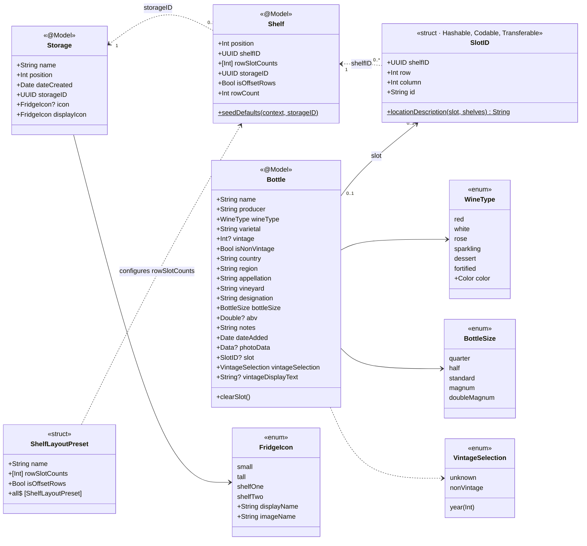
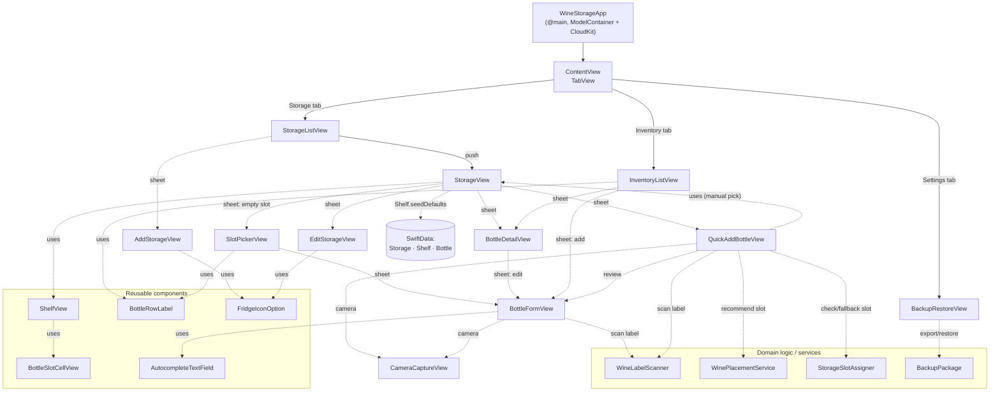

# WineStorage Architecture

UML diagrams of the app's structure, written in [Mermaid](https://mermaid.js.org/) so they render directly on GitHub.

The app is a SwiftUI + SwiftData iOS app, synced through CloudKit. It has three layers:

- **Models** (`WineStorage/Models`): SwiftData entities plus stateless domain logic for slot assignment and smart placement.
- **Services** (`WineStorage/Services`): label scanning. Vision OCR, then Apple Foundation Models interpret the text.
- **Views** (`WineStorage/Views`): SwiftUI screens that read data through `@Query` and write through `ModelContext`.

## 1. Data model

`Storage`, `Shelf` and `Bottle` are the three `@Model` classes registered in the `ModelContainer` (`WineStorageApp.swift`). There are no SwiftData `@Relationship`s between them. They link through stable UUIDs instead, which keeps the schema CloudKit-compatible:

- `Shelf.storageID` → `Storage.storageID`
- `Bottle.slot` (`SlotID`, stored as private `shelfID`/`row`/`column`) → `Shelf.shelfID`

A bottle with `slot == nil` is unplaced. It sits in the shared inventory and belongs to no storage unit.

## 2. Domain logic and services

These are stateless `enum`/`struct` namespaces. Only the views call them, and none of them touches `ModelContext` except `BackupPackage`.

**Smart placement** (`QuickAddBottleView`) uses `WinePlacementService.findBestSlot`. It scores every free slot (from `StorageSlotAssigner`) by combining how similar the new bottle is to nearby bottles (`WineSimilarity`) with how far away they are (`StorageDistance`). It also adds a small bonus for similar immediate neighbours and a penalty for fragmenting free space.

**Label scanning** goes through `WineLabelScanner`, the single entry point that views call. The scanner runs OCR with `WineLabelTextRecognizer`, then hands the text to `WineLabelInterpreter`. The interpreter uses on-device Foundation Models guided generation to produce `WineLabelInfo`, which it maps to a typed `WineLabelExtraction`.

```mermaid
classDiagram
    direction TB

    namespace Placement {
        class WinePlacementService {
            <<enum>>
            +findBestSlot(bottle, storage, allShelves, allBottles)$ PlacementRecommendation?
            +scoreCandidateSlot(...)$ CandidateSlotScore
        }
        class PlacementRecommendation {
            <<struct>>
            +SlotID slot
            +Double totalScore
            +[String] matchedCharacteristics
            +[NearbyBottle] nearestBottles
            +[CandidateSlotScore] candidateScores
        }
        class CandidateSlotScore {
            <<struct>>
            +SlotID slot
            +Double similarityDistanceScore
            +Double neighborBonus
            +Double fragmentationScore
            +Double total
        }
        class WineSimilarity {
            <<enum>>
            +similarity(a, b)$ Result
        }
        class StorageDistance {
            <<enum>>
            +coordinates(slot, shelvesByID)$ Coordinates?
            +distance(a, b)$ Double
            +distanceWeight(distance)$ Double
            +areImmediateNeighbors(a, b)$ Bool
            +immediateNeighborSlots(slot, shelf)$ [SlotID]
        }
        class StorageSlotAssigner {
            <<enum>>
            +occupiedSlots(bottles)$ Set~SlotID~
            +availableSlots(shelves, bottles)$ [SlotID]
            +firstAvailableSlot(shelves, bottles)$ SlotID?
            +isAvailable(slot, bottles)$ Bool
        }
    }

    namespace LabelScanning {
        class WineLabelScanner {
            <<enum>>
            +scan(image)$ Outcome
        }
        class Outcome {
            <<enum>>
            extracted(WineLabelExtraction)
            interpreterUnavailable(reason)
        }
        class WineLabelTextRecognizer {
            <<enum · Vision>>
            +recognizeText(image)$ String
        }
        class WineLabelInterpreter {
            <<struct · FoundationModels>>
            +availability()$ Availability
            +interpret(ocrText) WineLabelExtraction
        }
        class WineLabelInfo {
            <<@Generable struct>>
            raw model output
        }
        class WineLabelExtraction {
            <<struct>>
            typed, optional label fields
        }
    }

    namespace Backup {
        class BackupPackage {
            <<struct · Codable>>
            +Date createdDate
            +[StorageRecord] storages
            +[ShelfRecord] shelves
            +[BottleRecord] bottles
            +init(modelContext)
            +init(data)
            +encoded() Data
            +restore(into modelContext)
        }
        class BackupDocument {
            <<struct · FileDocument>>
            +Data data
        }
    }

    WinePlacementService ..> StorageSlotAssigner : candidate slots
    WinePlacementService ..> WineSimilarity : score similarity
    WinePlacementService ..> StorageDistance : weight by distance
    WinePlacementService --> PlacementRecommendation : returns
    PlacementRecommendation *-- CandidateSlotScore

    WineLabelScanner ..> WineLabelTextRecognizer : 1. OCR
    WineLabelScanner ..> WineLabelInterpreter : 2. interpret
    WineLabelScanner --> Outcome : returns
    WineLabelInterpreter ..> WineLabelInfo : generates
    WineLabelInterpreter --> WineLabelExtraction : maps to
    Outcome --> WineLabelExtraction

    BackupDocument ..> BackupPackage : wraps encoded
```

## 3. Views and navigation

`ContentView` is a `TabView` with three `NavigationStack`s. Each edge label gives the kind of link: a tab, a `push` (navigation), a `sheet` (a sheet or full-screen cover), or `uses` (an embedded subview or a service call).

## Tests

- `WineStorageTests/WinePlacementServiceTests.swift` covers the placement scoring in diagram 2.
- `WineStorageUITests/` holds the default Xcode UI test scaffolding.
